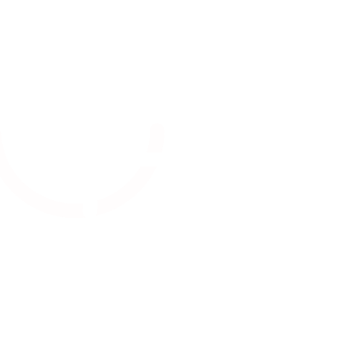

```
 __   ____  ____  __      _  _  ____  __  ____  ____   __  
(  ) (_  _)(_  _)(  )    / )( \(  __)(  )(  _ \(    \ /  \ 
/ (_/\ )(    )(  / (_/\  \ /\ / ) _)  )(  )   / ) D ((  O )
\____/(__)  (__) \____/  (_/\_)(____)(__)(__\_)(____/ \__/ 
```

A Rust #no-std optimized wave table synthesizer for embedded devices.

<div style="background: linear-gradient(to right, #ff7e5f, #feb47b);">
  
</div>

## How to use it

```rust
#![no_std]

use little_weirdo::synth::patch::Patch;
use little_weirdo::synth::Synth;
// Choose a predefined patch (or create your own).
let patch: Patch = Patch:default();
// Create an instance of LttL Weirdo.
let mut synth: Synth = Synth::new(44100, patch);
// Play a note (Voice = 0, Note (C4) = 60, Velocity (Max) = 127)
synth.note_on(0, 50, 127);
// Clock LttL Weirdo in a loop.
let sample = synth.clock_and_output();
```


## Tools & Examples

[`create_wave_table.rs`](/examples/create_wave_table.rs) This program generates a list of static waveforms in the form of arrays of 16-bit integers by reading WAV files from the "data" directory and printing them out as pub static variables. It's to be used to pre-compute and store waveforms that can be reused later.

```
$ cargo run --example create-wave-table 
```

See [Generated Wavetables](/src/synth/data/wavetables.rs)


[`streaming-synth.rs`](/examples/streaming-synth.rs) This program demonstrates how to use CPAL (Cross Platform Audio Library) to create a synthesizer that generates sound in real-time using Little Weirdo. Very handy for development en testing without a embedded device.

```
$ cargo run --example streaming-synth 
```

[`create_note_to_frequency.rs`](/examples/create_note_to_freq_table.rs) This program calculates and prints the frequencies of all 127 semitone steps in the MIDI range (0-127). The output is a list of frequencies, where each frequency is represented as an integer (in Hz) corresponding to its semitone step number.

```
$ cargo run --example create_wave_table 
```

See [Generated Frequencies](/src/synth/data/frequencies.rs)

## Building

### Library
```
$ cargo build
```

### LttL Weirdo - VST3/Clap Plugin 
```
$ cd plugin/lttl_squeaky
$ cargo xtask bundle lttl_squeaky --release
```